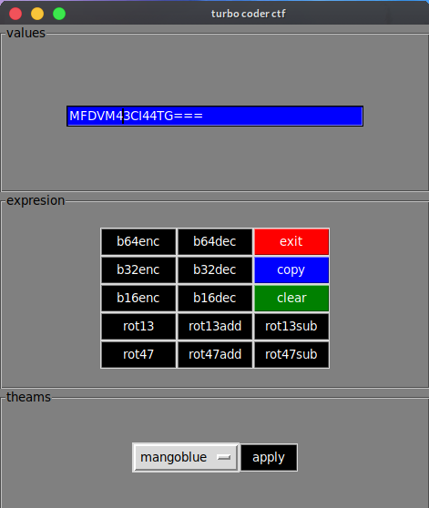

# turbo-coder-ctf

fast gui encoder and decoder tool for ctf

* Need: gui interface
* module: codelib
* package: python3-tk

**Installation:**
```bash
$ git clone https://github.com/Madhava-mng/turbo-coder-ctf.git
```

**run:**

```python
$ ./turbo-coder.py
```

